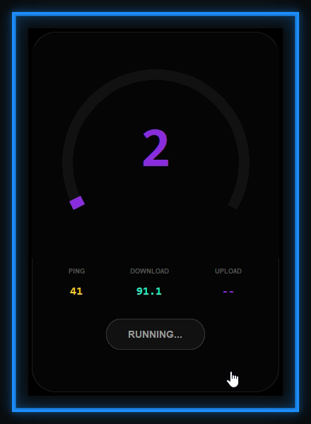
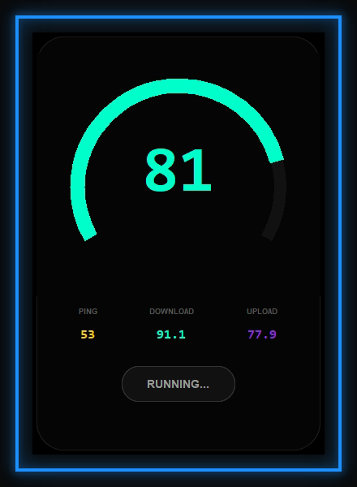

  <b>Speed Test is  network performance monitoring tool</b>

## Usage Instructions

1. Start the Application: Run the executable or speed.py script. The app will appear in the bottom-right corner of your primary screen.
2. Toggle Visibility: Press F8 at any time to show or hide the application window.
3. Rapid Hiding: Press the Esc key to quickly hide the application to the system tray.
4. System Tray Menu: Right-click the icon in the notification area to access options such as forced show, hide, or exit.
5. Exit: To fully terminate the application, use the Exit option in the system tray menu.

### Screenshots
| Image | Image |
|---|---|
|  |  |

## Build Information

> The application is bundled using PyInstaller with specific windowless configurations to prevent console popups and ensure high performance on Windows systems. The current build includes a critical fix for standard stream redirection, preventing crashes in windowless (noconsole) mode.

## Video 

---

## Key
| Key | Action |
|-------|-------|
| F8  | show or hide  |

### Author
**YASSER-27** - [GitHub](https://github.com/YASSER-27)

